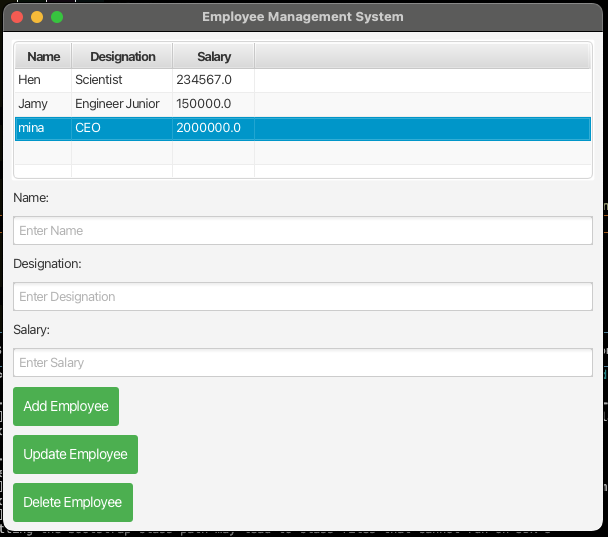

# **📌 Employee Management System**  
*A JavaFX & Spring Boot Application*  

  
  
  
  

---

## **📚 Overview**
The **Employee Management System** is a **desktop application** built with:
- **Frontend:** JavaFX
- **Backend:** Spring Boot (REST API)
- **Database:** MySQL

- Demo:
[Click here to watch the demo](https://private-user-images.githubusercontent.com/121528869/416436693-93263e79-1b87-446d-8727-f12c44455b79.mp4?jwt=eyJhbGciOiJIUzI1NiIsInR5cCI6IkpXVCJ9.eyJpc3MiOiJnaXRodWIuY29tIiwiYXVkIjoicmF3LmdpdGh1YnVzZXJjb250ZW50LmNvbSIsImtleSI6ImtleTUiLCJleHAiOjE3NDA0NDUyNDAsIm5iZiI6MTc0MDQ0NDk0MCwicGF0aCI6Ii8xMjE1Mjg4NjkvNDE2NDM2NjkzLTkzMjYzZTc5LTFiODctNDQ2ZC04NzI3LWYxMmM0NDQ1NWI3OS5tcDQ_WC1BbXotQWxnb3JpdGhtPUFXUzQtSE1BQy1TSEEyNTYmWC1BbXotQ3JlZGVudGlhbD1BS0lBVkNPRFlMU0E1M1BRSzRaQSUyRjIwMjUwMjI1JTJGdXMtZWFzdC0xJTJGczMlMkZhd3M0X3JlcXVlc3QmWC1BbXotRGF0ZT0yMDI1MDIyNVQwMDU1NDBaJlgtQW16LUV4cGlyZXM9MzAwJlgtQW16LVNpZ25hdHVyZT1mNGM5MmEyMGE1Mzg1MDMxM2UxOTk4NzYwZjRmMWE1OWFiY2QyMzY0OGMwNjU3ODYxYjc3YjE2MmUyNzBjMGI1JlgtQW16LVNpZ25lZEhlYWRlcnM9aG9zdCJ9.pulr6h4S8XHrSmAmEfM1qcHwEftBzk2RCKlXvQivMXg)

👉 **Key Features**:
- View employees in a table 📊  
- Add new employees ➕  
- Update employee details ✏️  
- Delete employees ❌  
- Validations & Error Handling ⚠️  

---

## **⚙️ Prerequisites**
✅ Install **Java 23.0.2**  
✅ Install **Maven**  
✅ Install **MySQL**
✅ Clone the project:  

    git clone https://github.com/jnima2022/Employee-Management-System.git
    cd EmployeeManagementSystem

---

## **🚀 Running the Project**
#### **1️⃣ Start Backend**

    - cd backend
    - mvn spring-boot:run

    - Runs the **Spring Boot API** at `http://localhost:8080/api/employees`

#### **2️⃣ Start JavaFX Frontend**

    - cd frontend
    - mvn javafx:run

    - Opens the **JavaFX GUI**

---

## **🖥️ Application Screenshots**
✅ **Main Dashboard**  
- 

---

## **⚖️ Technologies Used**
| Technology     | Usage           |
|---------------|----------------|
| **Java 23.0.2** | Programming Language |
| **Spring Boot** | Backend API |
| **JavaFX**    | GUI Framework |
| **MySQL**     | Relational Database |
| **Maven**     | Dependency Management |

---

## **📌 API Endpoints**
| HTTP Method | Endpoint | Description |
|------------|----------|------------|
| **GET** | `/api/employees` | Get all employees |
| **POST** | `/api/employees` | Add new employee |
| **PUT** | `/api/employees/{id}` | Update employee |
| **DELETE** | `/api/employees/{id}` | Delete employee |

---

## **📌 Future Improvements**
🔹 Add a **Login System**  
🔹 Implement **Role-Based Access**  
🔹 Improve Database Optimization  

